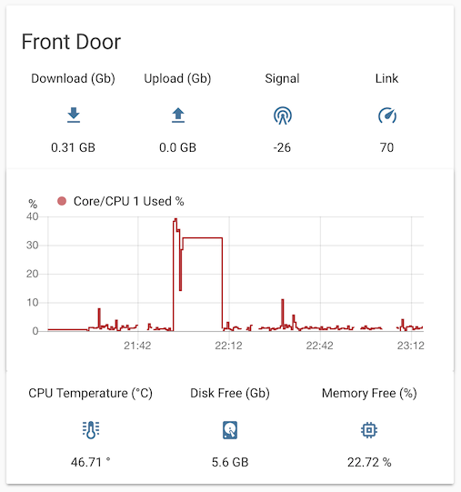

# Home Assistant - Monitoring API

Welcome to the lightweight "ha-monitor-api" project! 

This is a quick-and-dirty lightweight API _(knocked out in an evening)_ designed to expose the system's current metrics _(such as disk, network, cpu/temperature etc)_ as a simple JSON endpoint that your Home Assistant instance can query.

It's been designed to run in a Docker Container (Ideally on your other hosts on your network - such as an external Raspberry Pi Webcam box, your Home-made weather station, or your DIY BLE/Zigbee Gateway etc - so that you can quickly feed metrics back to Home Assistant.

It does not aim to store metrics on disk, create fancy graphs etc - there's loads of other tools out there like Zabbix & Prometheus + Grafana etc - The primary goal of this tool is to expose a simple lightweight API that runs in a docker container exposing monitoring stats in real-time that can be fed into your other systems.

---------------------------------------------

**Docker Hub:** [`bushrangers/ha-monitor-api`](https://hub.docker.com/r/bushrangers/ha-monitor-api/)


 

**NOTE:** The following system architectures are currently supported: `arm`, `arm64`, `amd64`. - If you're running on an architecture other than these the process will not start / you will need to build the docker image yourself.


## Prerequisites

- Docker
- Docker-compose
- Linux OS that you wish to monitor (such as a RaspberryPi etc)

## Standing up

It's pretty straightforward, just clone down the sources and stand up the container like so:

```bash
# Clone down sources on the host you want to monitor...
git clone https://github.com/ned-kelly/ha-monitor-api /opt/ha-monitor-api
cd /opt/ha-monitor-api

# Stand up the container
docker-compose up -d

```

## Configuration Variables

### Security
By default the service will be hosted via HTTP and no authentication. If you need to secure it you can protect it against sniffing attacks via HTTPS/TLS and enable [digest authentication](https://en.wikipedia.org/wiki/Digest_access_authentication) to keep your metrics private. It is possible to only enable TLS or only enable digest authentication. It is recommended to enable both though.

Set the `TLS_CRT` and `TLS_KEY` environment variables in your compose file to let the service run on HTTPS. `TLS_CRT` will need to point to the TLS certificate file, `TLS_KEY` to the TLS key file belonging to that certificate. You can mount those files into the Docker container through the volumes setting in your compose file.

Set the `AUTH_REALM` and `AUTH_DIGESTFILE` environment variables in your compose file to enable digest authentification. `AUTH_REALM` can be any string identifying your server. `AUTH_DIGESTFILE` will need to point to a valid digest file containing one or more sets of usernames and passwords (it is limited to one unique realm for all users though). To create a digest file run `htdigest -c YOURDIGESTFILE YOURREALM YOURUSERNAME` (changing the uppercase values to your liking). You'll be asked to enter the corresponding password twice and the file will be created. To add further users to that digest file run the same command without the `-c` parameter. You can mount the file into the Docker container through the volumes setting in your compose file.

### Port
By default the service listens on TCP:9999 (on all interfaces). If you need to change the port, you may do so by setting the `LISTEN_PORT` environment variable in your compose file.

## Integrating to Home Assistant

Integrating into Home Assistant can be done like any other sensor using the [RESTful Sensor](https://www.home-assistant.io/components/sensor.rest/).

An example here is taken from my OrangePI - _(Running [Facial Recognition](https://www.hackster.io/97766/announce-who-is-home-using-facial-recognition-dcc389) by scraping all my friends's profile pictures off Facebook)..._

**_Your (sensors/configuration.yaml) file:_**

```yaml
# Sensor to monitor system resources for the Front Door PI.
- platform: rest
  name: Front Door
  resource: http://10.16.10.144:9999/
  timeout: 30
  json_attributes:
    - cpu_current
    - cpu_free
    - cpu_average
    - cpu_temperature
    - drive
    - memory
    - network
  value_template: '{{ value_json.value}}'
  headers:
    Content-Type: application/json
    User-Agent: Home Assistant Agent
  # uncomment the following 3 lines when authentication is enabled
  #authentication: digest
  #username: john
  #password: mysafepassword

# To use the data on the Home Assistant Lovelace Dashboard we need to extract the values from the sensor, and store them as their own sensor values...
- platform: template
  sensors:
    front_door_cputemp:
      value_template: '{{ states.sensor.front_door.attributes["cpu_temperature"] }}'
      unit_of_measurement: '°'
      entity_id: sensor.front_door
    front_door_cpuused:
      value_template: '{{ states.sensor.front_door.attributes["cpu_current"] }}'
      unit_of_measurement: '%'
      entity_id: sensor.front_door
    front_door_freegb:
      value_template: '{{ states.sensor.front_door.attributes["drive"]["freeGb"] }}'
      unit_of_measurement: 'GB'
      entity_id: sensor.front_door
    front_door_driveused:
      value_template: '{{ states.sensor.front_door.attributes["drive"]["usedPercentage"] }}'
      unit_of_measurement: '%'
      entity_id: sensor.front_door
    front_door_freemem:
      value_template: '{{ states.sensor.front_door.attributes["memory"]["freeMemPercentage"] }}'
      unit_of_measurement: '%'
      entity_id: sensor.front_door
    front_door_networklevel:
      value_template: '{{ states.sensor.front_door.attributes["network"]["wlan0"]["wireless"]["qualityLevel"] }}'
      entity_id: sensor.front_door
    front_door_networklink:
      value_template: '{{ states.sensor.front_door.attributes["network"]["wlan0"]["wireless"]["qualityLink"] }}'
      entity_id: sensor.front_door
    front_door_networkin:
      value_template: '{{ states.sensor.front_door.attributes["network"]["wlan0"]["inputBytes"] | multiply(0.000000001024) | round(2) }}'
      entity_id: sensor.front_door
      unit_of_measurement: 'GB'
    front_door_networkout:
      # Multiply pipe will convert bytes to gb.
      value_template: '{{ states.sensor.front_door.attributes["network"]["wlan0"]["outputBytes"] | multiply(0.000000001024) | round(2) }}'
      entity_id: sensor.front_door
      unit_of_measurement: 'GB'

```

And of course, this data is all well and good - but what about putting it in the Lovelace UI? - I'm using the awesome ["vertical-stack-in-card"](https://github.com/custom-cards/vertical-stack-in-card) here to combine multiple cards as one card like so:



**_Your Lovelace raw YAML config:_**

```yaml
show_header_toggle: false
title: Front Door
type: 'custom:vertical-stack-in-card'
cards:
  - type: glance
    columns: 4
    entities:
      - entity: sensor.front_door_networkin
        icon: 'mdi:download'
        name: Download (Gb)
      - entity: sensor.front_door_networkout
        icon: 'mdi:upload'
        name: Upload (Gb)
      - entity: sensor.front_door_networklevel
        icon: 'mdi:radio-tower'
        name: Signal
      - entity: sensor.front_door_networklink
        icon: 'mdi:speedometer'
        name: Link
  - type: history-graph
    entities:
      - entity: sensor.front_door_cpuused
        name: Core/CPU 1 Used %
  - type: glance
    columns: 3
    entities:
      - entity: sensor.front_door_cputemp
        icon: 'mdi:thermometer-lines'
        name: CPU Temperature (°C)
      - entity: sensor.front_door_freegb
        icon: 'mdi:harddisk'
        name: Disk Free (Gb)
      - entity: sensor.front_door_freemem
        icon: 'mdi:memory'
        name: Memory Free (%)
```

## Closing Comments

This is still a work-in-progress and a quick-and-dirty hack in an evening into Home Assistant - PR's are welcome - obviously this project can also be used for much more than Home Assistant, but for now it's a great means to an end that uses minimal resources on my low-end SBC's.
